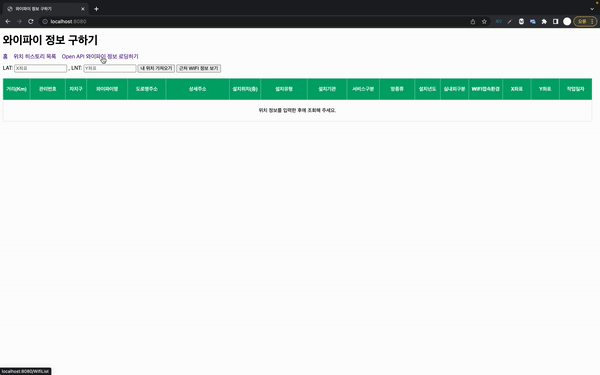
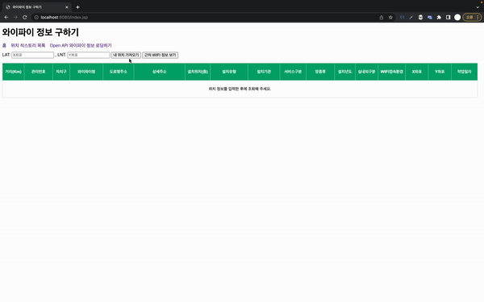
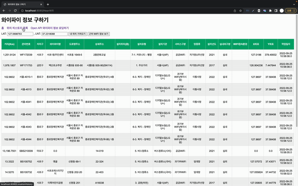

# Public Wifi Service

## 🎯서울시 공공 와이파이 위치 조회 서비스

### 📋 개발환경

* Language
    * Java 8
* DataBase
    * MariaDB 10.8.3
* Dependencies
    * assertj 3.11.1
    * gson 2.9.1
    * jdbc-mysql 8.0.30
    * junit 5.8.2
    * jstl 1.2
    * lombok 1.18.24
    * okhttp 4.9.3
    * tomcat 8.5.82

### ✅ 주요 기능
-  현재 위치의 좌표 찾기
-  좌표를 기준으로 가까운 공공 와이파이 찾기
-  위치에 대한 히스토리 조회

### 📀 시뮬레이션

| 와이파이 정보 가져오기 | 가까운 공공 와이파이 찾기                                        | 위치에 대한 히스토리 조회하기 |
|------|-------------------------------------------------------|------------------|
||  |

### ℹ️ API 정보

* [서울시 공공 와이파이 서비스 위치 정보](https://data.seoul.go.kr/dataList/OA-20883/S/1/datasetView.do)

